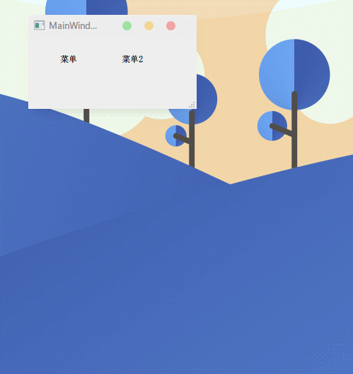

FacileMenu
====

## 介绍

非常飘逸的 Qt 菜单控件，带有各种动画效果，用起来也十分方便。

无限层级，响应键盘、鼠标单独操作，支持单快捷键。

允许添加自定义 widget、layout，当做特殊的 QDialog 使用。


## 简单使用

1. 放入源代码
   将 `facile_menu` 文件夹放入 Qt 程序，pro 文件的 `INCLUDEPATH` 加上对应路径

2. 包含头文件
   `#include "facile_menu.h"`

3. 创建并显示菜单

   ```C++
   // 创建菜单
   FacileMenu* menu = new FacileMenu(this);
   
   // 添加动作
   menu->addAction(QIcon(":/icons/run"), "开始播放 (&S)", [=]{
       /* 某操作 */
   })->tip("Ctrl+S")->disable()->hide();
   
   // 显示菜单
   menu->execute(QCursor::pos());
   ```


## 常用操作

### 连续设置

```C++
menu->addAction(QIcon(":/icons/run"), "开始播放 (&S)", [=]{})
    ->tip("Ctrl+S")
    ->disable(true/*如果满足某条件(默认true)则disable，下同*/)
    ->hide(/*条件表达式*/)
    ->uncheck(false);
```


### 子菜单

```C++
auto subMenu = menu->addMenu("子菜单2");

subMenu->addAction("继续", [=]{});

subMenu3->addAction("停止", [=]{})
        ->disable(!playing);
```


### 横向菜单

方式一：一口气添加

```C++
menu->addRow([=]{
    menu->addAction("按钮1");
    menu->addAction("按钮2");
    menu->addAction("按钮3");
});
```

方式二：逐个添加

```C++
menu->beginRow();
menu->addAction(QIcon(":/icons/run"));
menu->addAction(QIcon(":/icons/pause"));
menu->split();
menu->addAction(QIcon(":/icons/resume"));
menu->addAction(QIcon(":/icons/stop"))->disable();
menu->endRow();
```

两种方式都支持横向布局 widget


### 添加 QAction

支持在菜单关闭时自动 delete 传入的 action，避免内存泄漏（默认开启）

```C++
QAction* action = ...;
menu->addAction(action, true/*是否在菜单关闭一起时delete*/);
```


### 添加 Widget/Layout

添加任意 widget 至菜单中，和菜单项并存。layout 同理。

```C++
QPushButton* button = new QPushButton("外部添加的按钮", this);
menu->addWidget(button);
```


### 添加选择项

> 如果要设置为checkable，请在创建时调用一次其以下任一方法：
>
> setCheckable(bool) / setChecked(bool) / check(bool) / uncheck(bool)

```C++
auto ac1 = subMenu2->addAction(QIcon(":/icons/run"), "选中1")->check()->linger();
auto ac2 = subMenu2->addAction("选中2")->uncheck()->linger();
auto ac3 = subMenu2->addAction("选中3")->uncheck()->linger();

// 点击事件
ac1->triggered([=]{
    subMenu2->uncheckAll(ac1); // 只选中ac1
});
ac2->triggered([=]{
    subMenu2->uncheckAll(ac2);
});
ac3->triggered([=]{
    subMenu2->uncheckAll(ac3);
});
```


### 批量添加单选项

```C++
QStringList texts;
for (int i = 0; i < 10; i++)
    texts << "项目"+QString::number(i);
static int selected = 2;

menu->addOptions(texts, selected, [=](int index){
    qDebug() << "选中了：" << (selected = index);
});
```


### 菜单项 API

`addAction()`后，可直接设置菜单项的一些属性，包括以下：

> 第一个参数为`bool`类型的，表示满足此条件才修改设置，例如：
>
> ```C++
> bool needHide = false;
> action->hide(needHide); // 不满足隐藏条件，不隐藏
> ```

```C++
// 菜单项右边快捷键区域的文字
// 如果要使用，建议用：setTipArea 来额外添加设置右边空白宽度
FacileMenuItem* tip(QString sc);

// 鼠标悬浮提示
FacileMenuItem* tooltip(QString tt);

// 触发（单击、回车键）后，参数为 Lambda 表达式
FacileMenuItem* triggered(FuncType func);

FacileMenuItem* disable(bool dis = true);

FacileMenuItem* enable(bool en = true);

FacileMenuItem* hide(bool hi = true);

FacileMenuItem* visible(bool vi = true);

FacileMenuItem* check(bool ch = true);

FacileMenuItem* uncheck(bool uc = true);

FacileMenuItem* text(bool te, QString str);
FacileMenuItem* text(bool exp, QString tru, QString fal);

// 满足条件使用前缀
FacileMenuItem* prefix(bool exp, QString pfix);
// 条件后缀，支持类似 "action (K)" 这样的格式
FacileMenuItem* suffix(bool exp, QString sfix, bool inLeftParenthesis = true);

// 直接设置前缀后缀
FacileMenuItem* prefix(QString pfix);
FacileMenuItem* suffix(QString sfix, bool inLeftParenthesis = true);

FacileMenuItem* icon(bool ic, QIcon icon);

// 设置边界：半径、颜色
FacileMenuItem* borderR(int radius = 3, QColor co = Qt::transparent);

// 点击后是否保持菜单显示（默认点一下就隐藏菜单）
FacileMenuItem* linger();

// 满足 iff 时执行 trueLambda 表达式，否则执行 falseLambda 表达式
FacileMenuItem* ifer(bool iff, trueLambda, falseLambda = nullptr);

// 逻辑控制
FacileMenuItem* ifer(bool iff); // 满足条件时才继续，下同
FacileMenuItem* elifer(bool iff);
FacileMenuItem* elser();

FacileMenuItem* switcher(int value);
FacileMenuItem* caser(int value, matchedLambda); // 匹配时执行lambda，无需break
FacileMenuItem* caser(int value); // 结束记得breaker（允许忘掉~）
FacileMenuItem* breaker();
FacileMenuItem* defaulter();

// 取消后面所有命令（无视层级，相当于函数中return）
FacileMenuItem* exiter(bool ex = true);
```


## 截图


