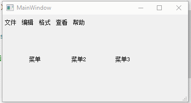

FacileMenu
====

## 介绍

非常飘逸的 Qt 菜单控件，带有各种动画效果，用起来也十分方便。

无限层级，响应键盘、鼠标单独操作，支持单快捷键。

允许添加自定义 widget、layout，当做特殊的 QDialog 使用。


## 简单使用

1. 放入源代码
   将 `facile_menu` 文件夹放入 Qt 程序，pro 文件的 `INCLUDEPATH` 加上对应路径，`resources` 里的资源文件 `sub_menu_arrow.png` （子菜单箭头）也导入，前缀别名为：`:/icons/sub_menu_arrow`（或按需修改）

2. `.pro` 文件需要添加 `QT += core gui svg`

3. 包含头文件 `#include "facile_menu.h"`

4. 创建并显示菜单

   ```C++
   // 创建菜单
   FacileMenu* menu = new FacileMenu(this);
   
   // 添加动作
   menu->addAction(QIcon(":/icons/run"), "开始播放 (&S)", [=]{
       /* 某操作 */
   })->tip("Ctrl+S")->disable()->hide();
   
   // 显示菜单
   menu->execute(QCursor::pos());
   ```


## 常用操作

### 连续设置

```C++
menu->addAction(QIcon(":/icons/run"), "开始播放 (&S)", [=]{})
    ->tip("Ctrl+S")
    ->disable(playing/*如果满足某条件(默认true)则disable，不满足跳过，下同*/)
    ->hide(/*条件表达式*/)
    ->uncheck(false);
```


### 子菜单

```C++
auto subMenu = menu->addMenu("子菜单2");

subMenu->addAction("继续", [=]{});

subMenu3->addAction("停止", [=]{})
        ->disable(!playing);
```


### 横向菜单

方式一：一口气添加

```C++
menu->addRow([=]{
    menu->addAction("按钮1");
    menu->addAction("按钮2");
    menu->addAction("按钮3");
});
```

方式二：逐个添加

```C++
menu->beginRow();
menu->addAction(QIcon(":/icons/run"));
menu->addAction(QIcon(":/icons/pause"));
menu->split();
menu->addAction(QIcon(":/icons/resume"));
menu->addAction(QIcon(":/icons/stop"))->disable();
menu->endRow();
```

两种方式都支持横向布局 widget


### 添加标题

```C++
menu->addTitle("标题", -1/0/1);
```

一个灰色文字的 QLabel，根据参数二会选择性添加一条分割线。

`-1` 添加到标题上方（margin=4），`0` 不添加分割线，`1` 添加到标题下方。默认为 `0`，不带分割线。


### 添加 QAction

支持在菜单关闭时自动 delete 传入的 action，避免内存泄漏（默认关闭）

```C++
QAction* action = ...;
menu->addAction(action, true/*是否在菜单关闭时一起delete*/);
```


### 添加 Widget/Layout

添加任意 widget 至菜单中，和菜单项并存，不占 `at(index)/indexOf(item)` 的位置。layout 同理。

```C++
QPushButton* button = new QPushButton("外部添加的按钮", this);
menu->addWidget(button);
```


### 添加单选菜单

> 如果要设置为checkable，请在创建时调用一次其以下任一方法：
>
> setCheckable(bool) / setChecked(bool) / check(bool) / uncheck(bool)

```C++
// 使用 linger() 使菜单点击后不隐藏，持续显示当前单选/多选结果
auto ac1 = subMenu2->addAction(QIcon(":/icons/run"), "带图标")->check()->linger();
auto ac2 = subMenu2->addAction("无图标")->uncheck()->linger();
auto ac3 = subMenu2->split()->addAction("全不选")->uncheck()->linger();

// 连接点击事件
ac1->triggered([=]{
    subMenu2->singleCheck(ac1); // 用于单选，表示只选中ac1
    // 这里可以用于处理其他操作
});
ac2->triggered([=]{
    subMenu2->singleCheck(ac2);
});
ac3->triggered([=]{
    subMenu2->uncheckAll(); // 全不选
});
```


### 添加多选菜单

```C++
// 假装是某一个需要多选的属性
QList<QString>* list = new QList<QString>();

for (int i = 0; i < 10; i++)
{
    auto action = subMenu5->addAction("选项"+QString::number(i))->uncheck()->linger()->autoToggle()/*点击自动切换选中状态*/;
    action->triggered([=]{
        // 自己的处理流程，例如调用某个外部的方法
        if (action->isChecked())
            list->append(action->getText());
        else
            list->removeOne(action->getText());
        qDebug() << "当前选中的有：" << *list;
    });
}
```


### 快速批量单选项

```C++
QStringList texts;
for (int i = 0; i < 10; i++)
    texts << "项目"+QString::number(i);
static int selected = 2;

menu->addOptions(texts, selected, [=](int index){
    qDebug() << "选中了：" << (selected = index) << texts.at(index);
});
```


### 快速批量多选项

监听每一项改变的结果

```C++
// 假装是某一个需要多选的属性
QList<int>* list = new QList<int>();
subMenu6->addNumberedActions("选项%1", 0, 10)
    ->setMultiCheck([=](int index, bool checked){
        if (checked)
            list->append(index);
        else
            list->removeOne(index);
        qDebug() << "当前选中的有：" << *list;
    });
```


### 极简批量多选项

直接读取多选项结果，而不是监听多选项每一项（也可以两者结合）

在`finished()`中获取`checkedItems()`，即为选中项

```C++
QList<QString>* list = new QList<QString>();
subMenu7->addNumberedActions("选项%1", 0, 15)->setMultiCheck()
    ->finished([=]{
        *list = subMenu7->checkedItemTexts();
        qDebug() << "最终选中：" << *list;
    });
```


### 菜单项 API

`addAction()`后，可直接设置菜单项的一些属性，包括以下：

> 第一个参数为`bool`类型的，表示**满足此条件才修改设置**，例如：
>
> ```C++
> bool needHide = false;
> action->hide(needHide); // 不满足隐藏条件，即无视此语句
> ```

```C++
// 菜单项右边快捷键区域的文字
// 如果要使用，建议用：setTipArea 来额外添加设置右边空白宽度
FacileMenuItem* tip(QString sc);
FacileMenuItem* tip(bool exp, QString sc);

// 鼠标悬浮提示
FacileMenuItem* tooltip(QString tt);
FacileMenuItem* tooltip(bool exp, QString tt);

// 触发（单击、回车键）后，参数为 Lambda 表达式
FacileMenuItem* triggered(FuncType func);
FacileMenuItem* triggered(bool exp, FuncType func);

// 当参数表达式为true时生效，false时忽略，下同
FacileMenuItem* disable(bool exp = true);
FacileMenuItem* enable(bool exp = true);

FacileMenuItem* hide(bool exp = true);
FacileMenuItem* visible(bool exp = true);

FacileMenuItem* check(bool exp = true);
FacileMenuItem* uncheck(bool exp = true);
FacileMenuItem* toggle(bool exp = true);

// 设置data，一般用于单选、多选
FacileMenuItem* setData(QVariant data);
QVariant getData();

FacileMenuItem* text(bool exp, QString str);
// 当表达式为true时，设置为tru文字，否则设置为fal文字
FacileMenuItem* text(bool exp, QString tru, QString fal);

FacileMenuItem* fgColor(QColor color);
FacileMenuItem* fgColor(bool exp, QColor color);

FacileMenuItem* bgColor(QColor color);
FacileMenuItem* bgColor(bool exp, QColor color);

// 插入前缀
FacileMenuItem* prefix(bool exp, QString pfix);
FacileMenuItem* prefix(QString pfix);

// 插入后缀，参数3支持类似 "action后缀 (K)" 这样的格式
FacileMenuItem* suffix(bool exp, QString sfix, bool inLeftParenthesis = true);
FacileMenuItem* suffix(QString sfix, bool inLeftParenthesis = true);

FacileMenuItem* icon(bool ic, QIcon icon);

// 设置边界：半径、颜色
FacileMenuItem* borderR(int radius = 3, QColor co = Qt::transparent);

// 点击后是否保持菜单显示（默认点一下就隐藏菜单）
FacileMenuItem* linger();
// 点击后保持显示（同linger()），并且修改菜单项文本
FacileMenuItem* lingerText(QString textAfterClick);

// 点击后的菜单文本改变
textAfterClick(QString newText);
// 根据当前文本修改为新文本的 Lambda 表达式
// 参数示例：[=](QString s) -> QString { if (s == "xx") return "xx"; }
textAfterClick(FuncStringStringType func);

// 满足 exp 时执行 trueLambda 表达式，否则执行 falseLambda 表达式
FacileMenuItem* ifer(bool exp, trueLambda, falseLambda = nullptr);

// 逻辑控制
FacileMenuItem* ifer(bool exp); // 满足条件时才继续，下同
FacileMenuItem* elifer(bool exp);
FacileMenuItem* elser();

FacileMenuItem* switcher(int value);
FacileMenuItem* caser(int value, matchedLambda); // 匹配时执行Lambda，无需break
FacileMenuItem* caser(int value); // 结束记得breaker（允许忘掉~）
FacileMenuItem* breaker();
FacileMenuItem* defaulter();

// 取消后面所有命令（无视层级，相当于函数中return）
FacileMenuItem* exiter(bool ex = true);
```


> 注意：由于加了一些容错处理（例如caser可以不用写breaker），无法进行if/switch的多层嵌套（较多的逻辑运算不建议放在菜单中）


### 动态菜单

在 FacileMenu 中先创建一个 item 作为菜单（示例中的 `m`），但是先不创建子菜单，直到鼠标悬浮上去的时候才创建并显示出来。

作用是可以显示动态加载的列表，比如**多层级嵌套的目录树**，如果一次性全部加载完那么会很费性能，可以等每次需要加载的时候才读取列表。

```C++
auto m = menu->addMenu("icon", "name", [=]{ /*...*/ });
menu->lastAddedItem()->setDynamicCreate(true)->setData("data1");
connect(m, &FacileMenu::signalDynamicMenuTriggered, this, [=](FacileMenuItem* item) {
    QString data = item->getData().toString(); // 字符串"data1"
    /*...处理代码...*/
});
```

#### 示例：目录树

```C++
void showFacileDir(QString path, FacileMenu *parentMenu, int level)
{
    // 这是方案一：显示的时候一次性加载所有的目录，但是要限制最大层级，否则文件太多导致卡顿
    // if (level >= maxLevel)
    //    return ;

    // 这是方案二：一个menu相当于一个外层文件夹，需要的时候连接信号，再动态加载目录
    auto connectDynamicMenu = [=](FacileMenu* menu) {
        connect(menu, &FacileMenu::signalDynamicMenuTriggered, this, [=](FacileMenuItem* item) {
            QString path = item->getData().toString();
            if (path.isEmpty())
            {
                qWarning() << "无法获取到目录路径" << path;
                return;
            }
            qInfo() << "动态加载目录列表：" << path;
            showFacileDir(path, item->subMenu(), -1);
        });
    };

    FacileMenu* menu = parentMenu;
    if (!parentMenu)
    {
        menu = new FacileMenu(this);
        connectDynamicMenu(menu);
    }

    auto infos = QDir(path).entryInfoList(QDir::Files | QDir::Dirs | QDir::NoDotAndDotDot);
    QFileIconProvider provicer;
    int count = 0; // 单个目录的文件数量上限，太多的话就不是菜单的事儿了
    foreach (auto info, infos)
    {
        if (++count > us->fastOpenDirFileCount)
        {
            menu->addTitle("总计文件(夹)数量：" + QString::number(infos.count()));
            break;
        }

        if (info.isDir())
        {
            auto m = menu->addMenu(provicer.icon(info), info.fileName(), [=]{
                menu->toClose(); // 先关闭菜单，得以隐藏面板；否则即使隐藏也会重新触发enter事件
                QDesktopServices::openUrl("file:///" + info.absoluteFilePath());
                if (hideAfterTrigger)
                {
                    QTimer::singleShot(0, [=]{
                        emit hidePanel();
                    });
                }
            });
            // 方案一：一口气加载
            // showFacileDir(info.absoluteFilePath(), m, level+1);
            
            // 方案二：动态加载
            menu->lastAddedItem()->setDynamicCreate(true)->setData(QString(info.absoluteFilePath()));
            connectDynamicMenu(m);
        }
        else
        {
            menu->addAction(provicer.icon(info), info.fileName(), [=]{
                menu->toClose();
                QDesktopServices::openUrl("file:///" + info.absoluteFilePath());
                if (hideAfterTrigger)
                {
                    QTimer::singleShot(0, [=]{
                        emit hidePanel();
                    });
                }
            });
        }
    }

    if (!parentMenu)
    {
        emit facileMenuUsed(menu);

        if (level != -1)
            menu->exec();
    }
}
```


## 配置项

### 静态统一颜色

都是静态变量，设置一次，所有菜单都生效。

```C++
FacileMenu::normal_bg = QColor(255, 255, 255);
FacileMenu::hover_bg = QColor(128, 128, 128, 64);
FacileMenu::press_bg = QColor(128, 128, 128, 128);
FacileMenu::text_fg = QColor(0, 0, 0);
FacileMenu::blur_bg_alpha = DEFAULT_MENU_BLUR_ALPHA;
```


### 单个菜单设置

一些可选的设置项，按需加上去，也可以都不加。

```C++
FacileMenu* menu = (new FacileMenu(this))
	->setTipArea("Ctrl+Alt+P") // 设置右边的快捷键提示区域的留空宽度，建议使用最长快捷键
	->setSplitInRow(true) // 横向按钮是否使用分割线分隔
    ->setSubMenuShowOnCursor(false) // 设置子菜单是从鼠标位置出现还是右边出现
    ->setAppearAnimation(false) // 菜单出现动画
    ->setDisappearAnimation(false); // 菜单消失动画
```

如果多级菜单中要将这些设置项传递给子菜单。

其中仅 `setTipArea` 不会传递给下一级。

可以直接修改源码中这些变量的默认值，全部菜单生效。


## 截图


## 菜单栏



结合 FacileMenu 自定义的一个菜单栏，目前不是很完善（做着玩的，但是对这个动画效果确实挺失望的）。

具体可参考 MainWindow 中的写法：

```C++
ui->menuBar->setAnimationEnabled(false); // 开启动画
ui->menuBar->addMenu("文件", fileMenu);
ui->menuBar->addMenu("编辑", editMenu);
ui->menuBar->addMenu("查看", viewMenu);
ui->menuBar->addMenu("帮助", helpMenu);
ui->menuBar->insertMenu(2, "格式", formatMenu);
```


## 注意点

### 打开**模态对话框**可能会引起崩溃

需要在打开模态对话框之前，关闭当前 menu

```C++
menu->addAction("选择文件", [=]{
    menu->close(); // 需要这句，否则会导致崩溃
    QString path = QFileDialog::getOpenFileName(this, "选择文件", prevPath);
    // ...
});
```


### 菜单关闭导致退出程序

在 `main.cpp` 中添加以下代码，使窗口关闭后不会退出整个程序：

```C++
QApplication a(argc, argv);
a.setQuitOnLastWindowClosed(false);
```
